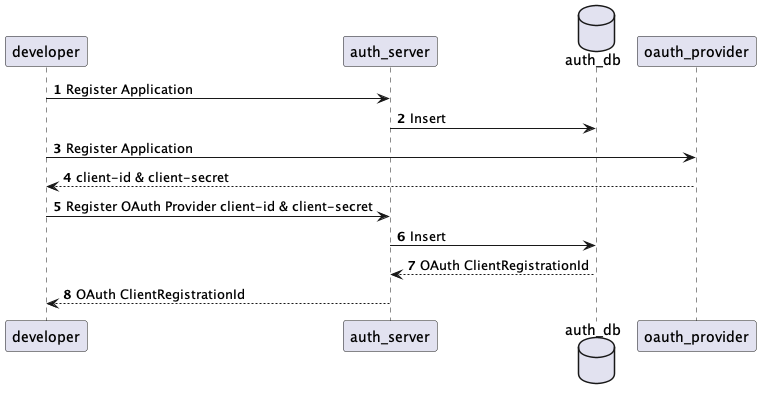
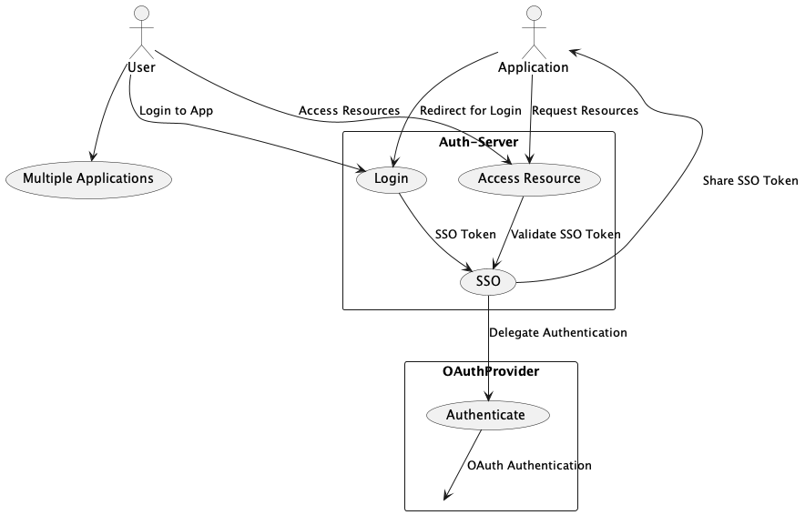

# Auth-Server

<details>
  <summary><strong>Getting Started</strong></summary>

### Requirements
- Java 17+
- Docker
- MySQL

### Setup Instructions

1. **Clone the repository**:
   ```bash
   git clone https://github.com/PARKPARKWOO/auth-server.git
   ```

2. **Build the project**:
   ```bash
   ./gradlew clean build
   ```

4. **Access the application**:
    - API: `http://localhost:8080`
    - Swagger UI: `http://localhost:8080/swagger-ui.html`
</details>


<details>
  <summary><strong>Diagram</strong></summary>

### UseCase



#### Description
1. Actor
- `Developer`는 주요 사용자로, 애플리케이션 및 OAuth Provider 관련 정보를 등록합니다.

2. Auth Server Use Cases:
- `Register Application`: 개발자가 애플리케이션을 등록하는 작업. 
- `Store OAuth Client Info`: 개발자가 등록한 client-id와 client-secret을 저장합니다.

3. OAuth Provider Use Cases:
- `Register Application at Provider`: OAuth Provider에 애플리케이션을 등록하고 client-id와 client-secret을 반환합니다.

4. Auth Database Use Cases:
- `Insert Application Data`: 애플리케이션 관련 데이터를 데이터베이스에 저장합니다.
- `Insert OAuth Client Info`: OAuth Provider에서 받은 정보를 데이터베이스에 저장합니다.

### Relationship


#### Description
1. 사용자와 여러 애플리케이션 간 관계:
- `User`는 Login 및 Access Resource를 통해 여러 `Application`에 접근할 수 있습니다.
- 다이어그램에서 User --> (Multiple Applications)로 표현합니다.

2. SSO 기능:
- Login은 Auth-Server의 SSO 유스케이스를 통해 Single Sign-On 기능을 제공합니다.
- SSO는 OAuth Provider와의 상호작용(Authenticate)을 통해 사용자 인증을 처리합니다.

3. OAuth Provider와 상호작용:
- OAuthProvider는 SSO를 지원하며, AuthService의 SSO와 상호작용합니다.
- 사용자 인증은 OAuth 표준에 따라 진행됩니다(Authenticate).

4. 애플리케이션 공유:
- SSO를 통해 발급된 토큰이 여러 애플리케이션에서 재사용되므로, SSO 유스케이스와 애플리케이션 간 상호작용을 추가합니다.
</details>